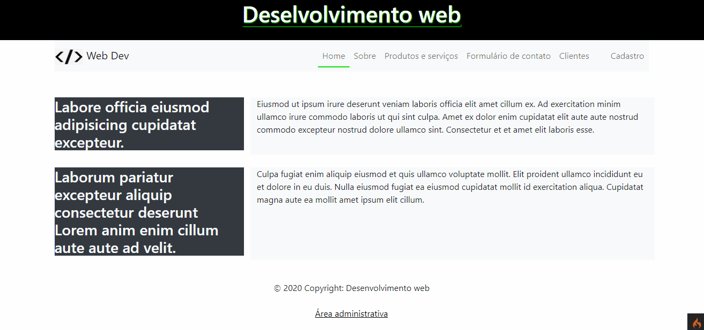
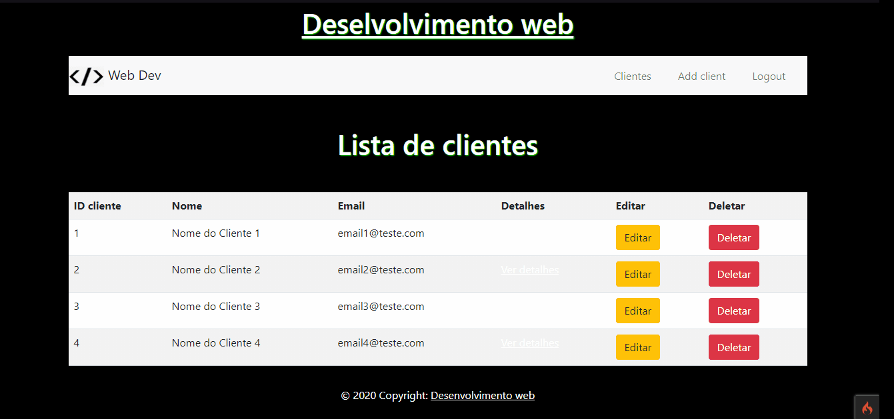

# pw_web
## Site desenvolvido na matéria de Programação web (Ulbra-Torres), onde a branch master foi o projeto feito em PHP puro e seguindo os padrões MVC, e a branch CodeIgniter sendo o projeto todo adicionado ao framework PHP CodeIgniter que também utiliza os padrões MVC.

Home do site             |  Página administrativa (requer login do admin)
:-------------------------:|:-------------------------:
  |  

<h4 align="center"> 
	🚧  CodeIgniter :fire: Projeto em construção...  🚧
</h4>

### Features 

- [x] Cadastro de usuário
- [ ] Cadastro de cliente
- [ ] Cadastro de produtos

### Pré-requisitos

Antes de começar, você vai precisar ter instalado em sua máquina as seguintes ferramentas:
Você precisara de um servidor PHP rodando juntamente com o mySQL, para isso você pode instalar o [WAMP](https://www.wampserver.com/en/), [XAMPP](https://www.apachefriends.org/pt_br/index.html), [MAMP](https://www.mamp.info/en). 
Além disto é bom ter um editor para trabalhar com o código como [VSCode](https://code.visualstudio.com/)

### 🎲 Rodando o Back End (servidor)
Você iniciara o server que você acabou de baixar e irá aguardar todos os serviços necessários iniciarem
O servidor inciará na porta:3333 - acesse <http://localhost:3333>
