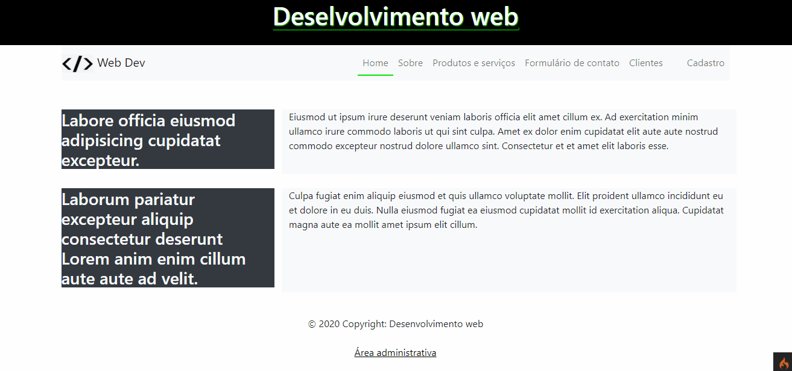
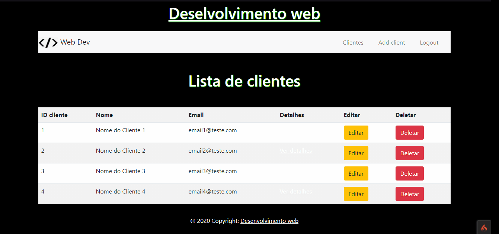

# pw_web
## Site desenvolvido na matéria de Programação web (Ulbra-Torres), onde a branch master foi o projeto feito em PHP puro e seguindo os padrões MVC, e a branch CodeIgniter sendo o projeto todo adicionado ao framework PHP CodeIgniter que também utiliza os padrões MVC.

Home do site             |  Página administrativa (requer login do admin)
:-------------------------:|:-------------------------:
  |  

<h4 align="center"> 
	Branch master, Projeto em PHP puro :elephant:
</h4>

### Features 

- [x] Cadastro de usuário
- [ ] Cadastro de cliente
- [ ] Cadastro de produtos

### Pré-requisitos

#### Docker CodeIgniter

Para conseguir rodar o projeto deve estar instalado o docker e o docker-composer
**(No windows ja possui tudo na ferramenta docker)**

Pasta www/ é a pasta raiz do servidor apache
Nas configurações do apache ja esta definido a pasta public do codeignite como a raiz, quando entrar no localhost:8080 ira abrir direto a pasta public.

##### Rotas

- Servidor apache: http://localhost:8080
- PHPMyAdmin: http://localhost:8081

##### LEVANTAR CONTAINER

Para levantar o container você pode usar os comandos abaixo ou entra no arquivo docker-composer.yml clicar com o botão direito e clicar na opção 'docker UP'.
(Deve estar com a extensão do docker instalado no vscode)

##### EXTENSÕES VSCODE

```sh
# Extensão para gerenciar os container direto do vscode
code --install-extension ms-azuretools.vscode-docker
```

##### COMANDOS

```sh
# Instalar o docker linux
sudo apt install docker &&
sudo apt install docker-compose &&
sudo gpasswd -a $USER docker

# Levantar o container
docker-compose -f "docker-compose.yml" up -d --build
# derrubar o container
docker-compose -f "docker-compose.yml" down
```

##### ERROS

- Deve estar ativo na bios a maquina virtual
- Verificar as permissões das pastas (sudo chmod -R 777 pasta/)

##### Criar um repositório

```sh
  git init
  git add .
  git commit -m "first commit"
  git branch -M main
  git remote add origin "Link do repositório"
  git push -u origin main
```

##### LINKS

- [Docker](https://www.docker.com/)
- [Repositorio origim](https://www.docker.com/)

### 🛠 Tecnologias

As seguintes ferramentas foram usadas na construção do projeto:

- [PHP](https://www.php.net/)
- [phpMyAdmin](https://www.phpmyadmin.net/)
- [MySQL](https://www.mysql.com/)
- [Bootstrap](https://getbootstrap.com/)
- [JavaScript](https://developer.mozilla.org/pt-BR/docs/Web/JavaScript)
- [Docker](https://www.docker.com/)


